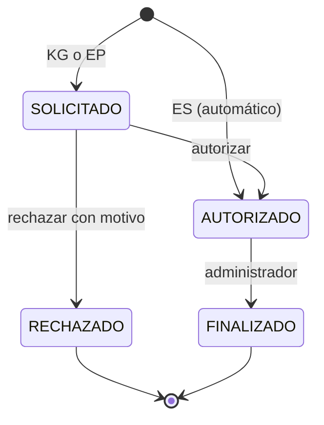

# Reglas de negocio

## 1. Alcance y fuente

Este documento consolida las reglas implementadas actualmente en `GAS/`. Es descriptivo: ante una discrepancia, el código en producción determina el comportamiento vigente hasta que ambos se corrijan en el mismo cambio.

## 2. Identidad y perfiles

| Perfil efectivo | Origen | Capacidades |
|---|---|---|
| `usuario` | Usuario autenticado sin perfil operativo | Crear y consultar sus pedidos; editar líneas aún no preparadas; crear y consultar sus solicitudes de copias. No recibe datos de stock. |
| `general` | `Usuarios_Admin` con perfil general/terminal/cuenta general | Las capacidades de usuario y, al crear pedidos, carga email, nombre y apellido del solicitante real. |
| `operador` | `Usuarios_Admin` con perfil operador/entrega | Se considera administrativo para gestionar entregas y copias. Al registrar una compra, realiza ingreso directo de stock. No ve compras ni actividad en el dashboard. |
| `admin` | `Usuarios_Admin` con perfil admin | Gestión completa de catálogo, pedidos, compras, copias, stock, auditoría y dashboard. |

- Los perfiles se resuelven por email y se almacenan en caché durante 300 segundos.
- Si `Usuarios_Admin` no posee encabezados reconocibles de email y perfil, todo valor con `@` se interpreta como administrador por compatibilidad heredada.
- La pertenencia Goethe se determina por el sufijo exacto `@goethe.edu.ar`.
- Todas las autorizaciones sensibles deben validarse en servidor.

## 3. Catálogo y stock

### 3.1 Alta de productos

- Solo un administrador efectivo puede crear productos.
- La categoría es obligatoria.
- Debe existir al menos un nombre en español o alemán.
- Unidad predeterminada: `unidad`.
- Stock mínimo y stock inicial no pueden quedar por debajo de cero; valores inválidos se normalizan a cero.
- El ID puede proporcionarse o generarse con los primeros cuatro caracteres normalizados de la categoría y una secuencia de tres dígitos.
- El ID debe ser único tanto en `Productos` como en `Stock`.
- No se admite un producto cuyo nombre español o alemán normalizado coincida con cualquiera de los nombres de un producto existente.
- La creación agrega una fila al catálogo y otra a stock. Si el stock inicial es positivo, también registra un movimiento.

### 3.2 Definiciones de stock

```text
stock comprometido = suma(cantidad pendiente + cantidad lista)
                      de pedidos Pendiente, Listo para retirar o Retirado parcial

stock disponible = máximo(stock físico - stock comprometido, 0)
```

- El stock físico solo cambia ante alta con stock inicial, ingreso directo, recepción de compra, retiro/entrega o ajuste manual.
- Preparar un pedido cambia cantidades comprometidas, pero no descuenta stock físico.
- Entregar o retirar descuenta stock físico.
- Recibir una compra incrementa el stock del producto efectivamente recibido, que puede diferir del solicitado.
- Todo cambio de stock debe registrar delta, valor anterior, valor nuevo, producto, usuario y referencia en `Movimientos_Stock`.
- Un ajuste manual puede dejar stock en cero, nunca en un valor negativo. El motivo es actualmente opcional.

## 4. Pedidos y retiros

### 4.1 Creación

- Un pedido contiene una o más líneas válidas; las líneas repetidas del mismo producto se consolidan sumando cantidades positivas.
- Los productos listados deben existir en el mapa de stock.
- El ID de lote usa `RET-<epoch en milisegundos>`.
- Cada línea inicia con `cantidadSolicitada = cantidadPendiente`, `cantidadLista = 0`, `cantidadRetirada = 0` y estado `Pendiente`.
- Para usuarios normales, el solicitante es el email de la sesión.
- Una cuenta general debe aportar email válido, nombre y apellido del solicitante; el nombre visible se guarda junto al email.
- La creación no rechaza explícitamente un pedido por falta de stock: el faltante se gestiona durante preparación o entrega.
- Se puede agregar un material no listado con un enlace HTTP(S) de referencia opcional. Se registra como una línea trazable e informativa para revisión operativa; no reserva, descuenta, ajusta ni puede marcarse como lista desde stock. El saldo puede cancelarse con motivo.

### 4.2 Edición por el solicitante

- El usuario solo puede editar líneas cuyo `Solicitante_Mail` coincida exactamente con su email.
- Una línea es editable únicamente si está `Pendiente`, sin cantidad lista ni retirada.
- Una cantidad mayor que cero reemplaza lo solicitado y pendiente.
- Una cantidad cero elimina lógicamente la línea: deja todas las cantidades activas en cero y el estado calculado pasa a `Cancelado`.
- Toda edición o eliminación agrega una observación y un evento de auditoría.
- El operador puede corregir la cantidad solicitada mientras la línea permanezca pendiente, sin preparación ni retiro previo; el cambio conserva auditoría.

### 4.3 Preparación, retiro y cancelación

- Solo un administrador efectivo puede gestionar líneas.
- Marcar como lista mueve como máximo el saldo pedido de `cantidadPendiente` a `cantidadLista`.
- Deshacer preparación exige motivo, no permite retiros previos y devuelve toda la cantidad lista a pendiente.
- Registrar retiro solo consume cantidad lista y exige stock físico suficiente.
- Si se retira menos que lo preparado, el remanente preparado vuelve a pendiente.
- Cancelar saldo exige motivo y lleva pendiente y lista a cero; lo ya retirado se conserva.
- Entrega completa es atómica a nivel de validación del caso de uso: primero verifica todas las líneas y no escribe si alguna carece de stock suficiente.
- Entrega parcial toma por cada línea el mínimo entre saldo total y stock físico disponible; falla si ninguna línea puede entregarse.
- Cada retiro descuenta stock físico, registra movimiento y notifica al solicitante.

### 4.4 Estados de una línea de retiro

El orden de evaluación implementado es:

| Condición | Estado |
|---|---|
| pendiente = 0, lista = 0 y retirada = 0 | `Cancelado` |
| lista > 0 | `Listo para retirar` |
| pendiente = 0, lista = 0 y retirada > 0 | `Retirado` |
| retirada >= solicitada y solicitada > 0 | `Retirado` |
| retirada > 0 | `Retirado parcial` |
| cualquier otro caso | `Pendiente` |

Invariantes esperadas por línea:

```text
cantidadSolicitada >= 0
cantidadLista >= 0
cantidadRetirada >= 0
cantidadPendiente >= 0
cantidadLista + cantidadRetirada + cantidadPendiente = cantidadSolicitada
```

La última igualdad puede dejar de cumplirse después de una cancelación de saldo, porque la cancelación descarta el saldo sin reducir `cantidadSolicitada`. En ese caso, la observación y auditoría explican la diferencia.

## 5. Compras

### 5.1 Registro

- Solo un administrador efectivo puede registrar compras.
- Las líneas repetidas se consolidan por producto y solo se conservan cantidades positivas.
- Cada producto solicitado debe existir.
- El ID de lote usa `COM-<epoch en milisegundos>`.
- Cada línea inicia con cantidad recibida cero, saldo igual a lo solicitado y estado `Pendiente`.
- La referencia o enlace es opcional y se conserva desde la primera línea original del producto consolidado.
- Se notifica al responsable de compras; una falla de correo no revierte el registro.
- Para el perfil `operador`, esta misma acción no crea una solicitud: genera un ingreso directo `ING-<epoch>` y suma las cantidades al stock.

### 5.2 Recepción y cancelación

- La recepción requiere cantidad positiva y un producto recibido existente.
- El producto recibido puede diferir del solicitado.
- Cada recepción suma a `cantidadRecibida`, incrementa stock del producto recibido y recalcula el saldo como `max(solicitada - recibida, 0)`.
- El código vigente no limita la recepción acumulada a la cantidad solicitada; una sobre-recepción deja saldo cero e incrementa stock por toda la cantidad recibida.
- Cancelar saldo exige motivo, lleva el pendiente a cero y no revierte recepciones ni stock previos.
- El procesamiento masivo puede recibir y cancelar saldo en una misma línea; ambos cambios se aplican antes de calcular el estado.

### 5.3 Estados de una línea de compra

| Condición | Estado |
|---|---|
| pendiente <= 0 y recibida <= 0 | `Cancelado` |
| pendiente > 0 y recibida > 0 | `Recibido parcial` |
| pendiente <= 0 y recibida > 0 | `Recibido` |
| cualquier otro caso | `Pendiente` |

## 6. Solicitudes de copias

### 6.1 Creación y archivo

- Solo una cuenta con email `@goethe.edu.ar` puede crear la solicitud.
- Cada solicitud registra el nombre declarado del solicitante junto con su email autenticado y fecha/hora; las filas históricas sin nombre muestran el email como respaldo.
- Niveles admitidos: `KG`, `EP`, `ES`.
- Páginas originales y cantidad de copias deben ser enteros mayores que cero.
- Tamaños admitidos: `A4`, `A3`, `OFICIO`.
- Modalidades admitidas: `ARMADAS`, `APILADAS`.
- Doble faz y color se normalizan a `SI` o `NO`.
- El comentario se recorta a 500 caracteres.
- Extensiones admitidas: PDF, DOC, DOCX, JPG, PNG, TXT y ZIP.
- El archivo debe contener al menos un byte y no superar 80 MB.
- El archivo se guarda en Drive bajo `<año>/<nivel>/<ID solicitud>/` y se renombra anteponiendo el ID.
- El ID usa `COP-<yyyyMMdd>-<secuencia de cuatro dígitos>`; la secuencia diaria se mantiene en Script Properties y la creación está protegida por lock.

### 6.2 Autorización

- Las solicitudes `ES` se autorizan automáticamente y pasan a `AUTORIZADO`.
- Las solicitudes `KG` y `EP` comienzan en `SOLICITADO` y requieren al menos un autorizador activo del nivel o de `TODOS`.
- El solicitante queda excluido de la lista y no puede decidir su propia solicitud.
- Un administrador con perfil exacto `admin` o un autorizador activo del nivel puede decidir.
- El enlace contiene el token original; la hoja conserva únicamente su hash SHA-256.
- El token vence a los 14 días.
- Decisiones admitidas: `AUTORIZAR` y `RECHAZAR`.
- Rechazar exige motivo, limitado a 500 caracteres.
- Una solicitud ya decidida responde de forma idempotente sin sobrescribir la primera decisión.

### 6.3 Finalización

- Solo un administrador efectivo puede finalizar.
- Solo se finaliza una solicitud en estado `AUTORIZADO`.
- La finalización registra usuario y fecha, pasa a `FINALIZADO` y notifica al solicitante.
- No existe transición implementada desde `RECHAZADO` o `FINALIZADO` hacia otro estado.



## 7. Auditoría y notificaciones

- Las operaciones relevantes agregan eventos a `Log_Auditoria` cuando la hoja existe.
- Cada evento general incluye fecha, email del usuario activo, acción y detalle JSON.
- Los cambios de existencias también se agregan a `Movimientos_Stock`.
- Copias mantiene además `Log_Copias`, que incluye la solicitud correlacionada y resultados de correo.
- Las fallas de correo no deben revertir una operación de negocio exitosa; se devuelven como advertencia o quedan en log.
- En pedidos de materiales, el único correo al solicitante se envía cuando una línea cambia efectivamente a `Listo para retirar`; no se envían correos por creación ni por retiro.
- La auditoría actual usa timestamps locales de GAS y claves locales. No incluye una clave de correlación ni estado de sincronización con DWH.

Todo nuevo modelo satélite debe incorporar campos de auditoría y claves de trazabilidad hacia el DWH central. El contrato exacto debe aprobarse mediante ADR antes de modificar el esquema.

## 8. Concurrencia, caché y errores

- Toda mutación principal se serializa con un `ScriptLock` y espera hasta 20 segundos.
- Después de una mutación se cambia `DATA_VERSION`, invalidando lógicamente la caché de catálogo y bootstrap.
- Datos de aplicación y catálogo pueden permanecer en caché hasta 45–60 segundos; roles, hasta 300 segundos.
- Una columna obligatoria ausente provoca un error explícito y detiene el caso de uso.
- No hay una transacción multitabla con rollback; auditoría y escritura principal pueden divergir ante una falla intermedia.

## 9. Brechas que requieren definición del propietario

No deben resolverse inventando reglas. Requieren decisión funcional y, cuando cambien estructura, un ADR:

- política de sobre-recepción de compras;
- obligatoriedad de motivo para ajuste manual de stock;
- retención y eliminación de archivos y logs de copias;
- clasificación y análisis de archivos cargados;
- SLA, recuperación y reconciliación de escrituras parciales;
- esquema, frecuencia, idempotencia y propiedad de la integración con DWH;
- timestamps UTC y claves de correlación comunes para todos los modelos.
