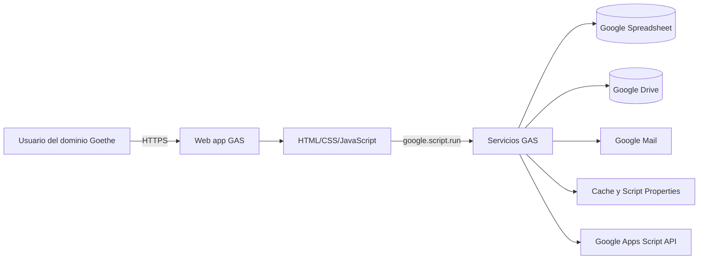

# Arquitectura de la aplicación GAS

## 1. Propósito y alcance

Este documento describe la arquitectura implementada en `GAS/` para la aplicación **Inventario Goethe**. La descripción se obtuvo del código fuente actual; no presupone infraestructura, procesos ni integraciones que no estén versionados en este repositorio.

La aplicación cubre cuatro capacidades:

- catálogo y existencias de productos;
- pedidos y retiros de insumos;
- solicitudes y recepción de compras;
- solicitudes, autorización y finalización de trabajos de copias.

Las reglas funcionales detalladas se mantienen en [business-rules.md](business-rules.md). La puesta en marcha y operación se documentan en el [README principal](../README.md).

## 2. Contexto arquitectónico

La solución es una aplicación web monolítica modular sobre Google Apps Script (GAS). El navegador usa HTML, CSS y JavaScript servidos por `HtmlService`; las llamadas al servidor se realizan mediante `google.script.run`. El backend ejecuta con la identidad del usuario que desplegó la aplicación y obtiene la identidad del usuario activo con `Session.getActiveUser()`.

No existe en el código actual una conexión con el Data Warehouse central ni un contrato de eventos o exportación. Incorporarla sería una decisión estructural y **debe documentarse mediante un ADR** antes de implementarse.

## 3. Estilo y límites internos

El despliegue GAS comparte un único ámbito global, pero el código está separado por responsabilidad. Es una variante pragmática de **Vertical Slice Architecture**: cada proceso de negocio agrupa sus casos de uso, mientras que configuración, autenticación, persistencia tabular y notificaciones son capacidades compartidas.

| Módulo | Responsabilidad |
|---|---|
| `Code.js` | Punto de entrada web e inclusión de fragmentos HTML. |
| `AppConfig.js` | Configuración, nombres de hojas, estados, caché, bloqueo y tolerancia a fallas de correo. |
| `Auth.js` | Identidad, perfiles, autorización y datos iniciales. |
| `CatalogoStock.js` | Catálogo, stock físico/disponible, alta de productos y acceso por encabezados. |
| `Pedidos.js` | Ciclo de pedidos, preparación, entrega, cancelación y ajuste de stock. |
| `Compras.js` | Solicitud, recepción, cancelación de saldo e ingreso directo de stock. |
| `Copias.js` | Solicitud, carga de archivos, autorización, finalización y log específico. |
| `RowModels.js` | Adaptadores entre filas de Spreadsheet y modelos usados por los casos de uso. |
| `MovimientosStock.js` | Libro append-only de movimientos de existencias. |
| `Audit.js` | Auditoría transversal y actividad reciente. |
| `MailTemplates.js` | Construcción de notificaciones HTML. |
| `AppInfo.js` | Metadatos de versión y despliegue. |
| `Dashboard.js` | Composición de la vista operativa administrativa. |
| `Index.html`, `Ui*.html`, `Estilos.html` | Presentación y control de estado en el cliente. |

### Dependencias permitidas

- La UI puede invocar funciones públicas de caso de uso, pero no accede directamente a Spreadsheet ni Drive.
- Los casos de uso dependen de helpers compartidos y adaptadores de filas.
- El acceso a datos se concentra en Google Spreadsheet; no hay repositorios abstractos ni una capa de dominio independiente.
- Las plantillas de correo no modifican estado.
- Las mutaciones críticas se ejecutan dentro de `withScriptLock_` para serializarlas.

Esta separación es adecuada para el tamaño actual. Extraer capas o servicios adicionales solo se justifica si aparece un segundo adaptador de persistencia, integración DWH o necesidad real de pruebas unitarias fuera del runtime GAS.

## 4. Persistencia y modelo de datos

El Spreadsheet configurado en `CONFIG.SPREADSHEET_ID` es la fuente de verdad operativa. Los módulos localizan columnas por encabezado, con normalización y algunos alias, para reducir el acoplamiento a posiciones físicas.

| Hoja | Función | Identificadores de correlación |
|---|---|---|
| `Productos` | Maestro bilingüe de productos. | `ID_Producto` |
| `Stock` | Existencia física actual. | `ID_Producto` |
| `Usuarios_Admin` | Perfiles operativos. | email |
| `Solicitantes` | Directorio de personas disponibles para cargar pedidos desde la terminal de copias. | `Apellido`, `Nombre`, `EmailProfesional`, `Estado` |
| `Solicitudes_Compra` | Líneas de lotes de compra. | `ID_Compra`, `Producto_Solicitado_ID`, `Producto_Recibido_ID` |
| `Pedidos_Retiro` | Líneas de pedidos de retiro. | `ID_Pedido`, `Producto_ID`, `Solicitante_Mail` |
| `Log_Auditoria` | Auditoría funcional general. | acción y detalle JSON; la referencia se almacena dentro del detalle |
| `Movimientos_Stock` | Libro de movimientos de stock. | `ID_Relacionado`, `Producto_ID` |
| `Solicitudes_Copias` | Solicitudes y estado de copias, con email y nombre visible del solicitante. | `ID_Solicitud`, `Archivo_ID`, `Solicitante_Email`, `Solicitante_Nombre` |
| `Usuarios_Copias` | Autorizadores por nivel. | email y nivel |
| `Log_Copias` | Auditoría específica de copias. | `ID_Solicitud` |

`Movimientos_Stock`, `Solicitudes_Copias`, `Usuarios_Copias` y `Log_Copias` pueden crearse automáticamente. El módulo de copias agrega encabezados faltantes de forma compatible. Las demás hojas y sus encabezados son precondiciones operativas.

### Consistencia e integridad

- Los lotes usan IDs basados en tiempo: `RET-<epoch>` y `COM-<epoch>`.
- Las solicitudes de copias usan `COP-<yyyyMMdd>-<secuencia diaria>`.
- Los productos usan un prefijo derivado de la categoría y una secuencia, por ejemplo `PAPE-001`.
- Las escrituras que afectan inventario, pedidos, compras o copias se protegen con un `ScriptLock` de 20 segundos.
- La actualización de varias hojas no es transaccional. Un error intermedio puede dejar una operación parcialmente aplicada porque Spreadsheet no ofrece rollback en este diseño.
- La caché se invalida mediante `DATA_VERSION` en Script Properties después de mutaciones exitosas.
- El envío de correo se trata como efecto secundario: su falla se registra y no revierte la operación principal.
- En pedidos de insumos, el correo al solicitante se emite solo al cambiar efectivamente a `Listo para retirar`; no se envía por alta, edición, retiro o entrega.

## 5. Seguridad

### Controles implementados

- El manifiesto limita el acceso de la web app al dominio (`access: DOMAIN`).
- Las operaciones administrativas llaman a `asegurarAdmin_()` o verifican `role.isAdmin`.
- El stock se omite de las respuestas para solicitantes no administrativos.
- Las solicitudes de copias solo admiten cuentas `@goethe.edu.ar`.
- Un solicitante no puede autorizar su propia solicitud de copias.
- Los enlaces de decisión guardan solo SHA-256 del token y vencen a los 14 días.
- La mutación se valida nuevamente en servidor; las restricciones de UI no constituyen autorización.
- Los archivos de copias restringen extensión, tamaño máximo (80 MB) y nombre de archivo.
- Las acciones relevantes generan auditoría general y, en copias, un log específico.

### Riesgos y deuda conocida

| Prioridad | Hallazgo | Tratamiento recomendado |
|---|---|---|
| Alta | El backend ejecuta como el usuario desplegador, por lo que una falla de autorización puede operar con privilegios de esa cuenta. | Mantener autorización server-side en todo endpoint público y revisar permisos del desplegador con mínimo privilegio. |
| Alta | No existe el `knowledge/security/threat-model.md` exigido por la gobernanza suministrada. | Crear y aprobar el threat model; incluir abuso de enlaces, archivos maliciosos, exfiltración y manipulación de hojas. |
| Alta | No hay trazabilidad hacia DWH (`DwhCorrelationId`, clave de origen o estado de sincronización). | Definir contrato de integración y auditoría mediante ADR antes de crear modelos o pipelines. |
| Media | `XFrameOptionsMode.ALLOWALL` permite embeber la aplicación. | Confirmar la necesidad; si no es obligatoria, restaurar una política restrictiva y documentarla en el threat model. |
| Media | Los IDs de Spreadsheet, carpeta Drive y destinatarios están acoplados al código. | Mover configuración dependiente del entorno a Script Properties; los IDs no son secretos, pero dificultan despliegues reproducibles. |
| Media | La extensión del archivo no demuestra su tipo ni que su contenido sea seguro. | Definir controles de contenido/antimalware y permisos de Drive conforme al threat model. |
| Media | El log general es opcional: si falta su hoja, la operación continúa sin auditoría. | Convertir auditoría obligatoria en operaciones sensibles o establecer monitoreo explícito de su disponibilidad. |
| Baja | Los tokens de decisión viajan en query string y pueden aparecer en historial o logs, aunque solo se persista su hash. | Minimizar exposición, evitar analítica de URLs y evaluar un flujo de confirmación con token de un solo uso. |

Los identificadores públicos de recursos no deben confundirse con credenciales. Las credenciales y secretos **no deben** incorporarse al repositorio; deben administrarse fuera de Git.

## 6. Disponibilidad, concurrencia y rendimiento

- La aplicación depende de las cuotas y disponibilidad de Apps Script, Spreadsheet, Drive y Mail.
- El `ScriptLock` evita carreras dentro del script, a costa de serializar las mutaciones y fallar si no obtiene el lock en 20 segundos.
- Los catálogos, roles y bootstrap usan `CacheService` con TTL de 45 a 300 segundos.
- Los valores mayores a 90.000 caracteres no se almacenan en caché.
- Las lecturas suelen cargar rangos completos. El diseño es razonable para volúmenes bajos o medios de operación escolar, pero deberá revisarse antes de crecer de forma sustancial.
- No se observan métricas, alertas, pruebas automatizadas ni procedimiento de recuperación versionados.

## 7. Despliegue y configuración

El proyecto usa `clasp`; `.clasp.json` vincula el directorio `GAS/` con un proyecto existente. `appsscript.json` declara runtime V8, zona horaria de Buenos Aires, scopes de Spreadsheet, Drive, correo, requests externos, lectura de deployments, storage e identidad.

La configuración específica de ambiente se encuentra hoy en `AppConfig.js`. Cualquier separación entre desarrollo, prueba y producción debería:

1. mantener la misma estructura de hojas;
2. externalizar IDs y destinatarios mediante Script Properties;
3. usar cuentas desplegadoras de mínimo privilegio;
4. validar scopes y acceso de Drive;
5. registrar versión y fecha del deployment.

## 8. Integración futura con DWH

La aplicación ya posee claves locales útiles (`ID_Producto`, `ID_Pedido`, `ID_Compra`, `ID_Solicitud`) y un libro de movimientos, pero esto no constituye trazabilidad DWH completa.

Todo nuevo modelo satélite o cambio de persistencia destinado al DWH debe incluir, como mínimo:

- clave estable del sistema origen;
- `DwhCorrelationId` o equivalente acordado;
- timestamps de creación y última modificación en UTC;
- actor de creación y modificación;
- sistema origen y versión de esquema;
- estado, fecha e identificador de sincronización;
- semántica de idempotencia y manejo de errores.

La elección entre extracción periódica desde Sheets, publicación de eventos o una API intermedia cambia límites, seguridad y consistencia. Por lo tanto, requiere un ADR que compare alternativas, propiedad de datos, reintentos, idempotencia, privacidad, retención y reconciliación.

## 9. Decisiones pendientes

Se deben registrar ADRs antes de:

- introducir integración con DWH;
- reemplazar Spreadsheet como fuente de verdad;
- dividir el monolito GAS en servicios;
- cambiar el modelo de ejecución o identidad del despliegue;
- habilitar embedding externo o modificar el perímetro de acceso;
- establecer una estrategia de almacenamiento y análisis de archivos de copias.

## 10. Limitaciones de este análisis

Al momento de redactar este documento no existen en el repositorio los contextos obligatorios `knowledge/architecture/` y `knowledge/security/threat-model.md`, ni `CLAUDE.md` o `permissions.md`. Tampoco están disponibles como skills cargados `governance/mcp-tool-wrapper.json` y `dotnet/dotnet10-clean-api.json`. Este documento debe reconciliarse con esas fuentes cuando se incorporen; el código actual de GAS y `CONVENTIONS.md` fueron la evidencia disponible.
